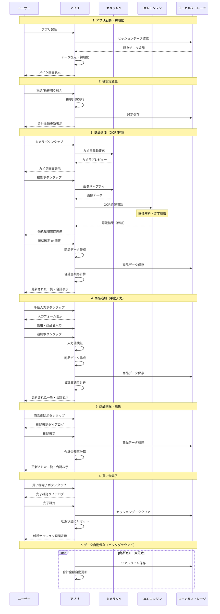

# ポケット会計 - シーケンス図

## ユーザーフローとシステム動作

以下のMermaidシーケンス図は、「ポケット会計」アプリの主要な機能とユーザー操作の流れを示しています。

## フロー説明

### 1. アプリ起動・初期化
- アプリ起動時に既存のセッションデータをチェック
- 中断された買い物セッションがある場合は復元
- 初回起動時は新規セッションを開始

### 2. 税設定変更
- ユーザーが税込/税抜を切り替え可能
- 変更時には既存商品の合計金額を再計算
- 設定はローカルストレージに保存

### 3. 商品追加（OCR使用）
- カメラで値札を撮影
- OCRエンジンで価格を自動認識
- 認識結果の確認・修正が可能
- 確定後は商品リストに追加

### 4. 商品追加（手動入力）
- 手動で価格と商品名を入力
- 入力値の検証を実施
- 確定後は商品リストに追加

### 5. 商品削除・編集
- 追加済み商品の個別削除が可能
- 削除前に確認ダイアログを表示
- 数量変更機能も同様のフローで実装

### 6. 買い物完了
- セッション終了時にデータをクリア
- 新しい買い物セッションを開始可能
- 履歴機能実装時は完了データを保存

### 7. データ自動保存
- 商品の追加・変更時に自動的にデータを保存
- アプリクラッシュ時のデータ損失を防止
- リアルタイムで合計金額を更新